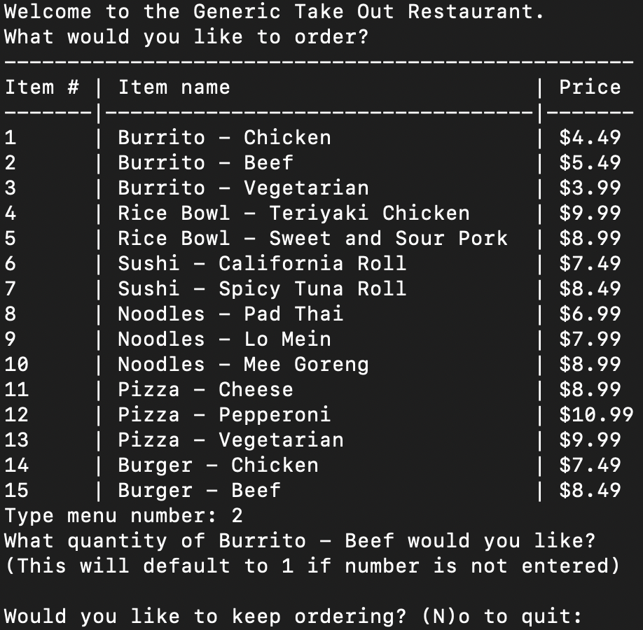
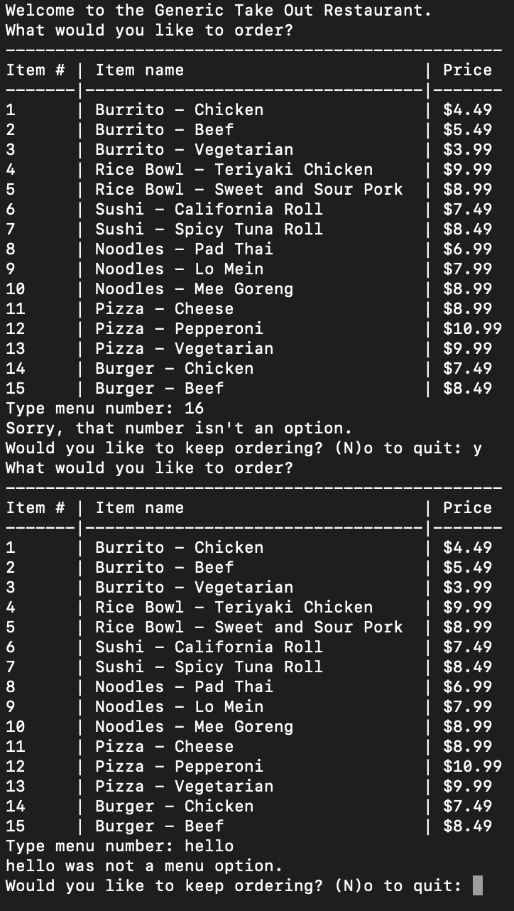

# Takeout Restaurant Menu and Order System

## Project Summary

The **Takeout Restaurant Menu and Order System** is a Python-based command-line application designed to provide an accessible and user-friendly ordering experience for customers, particularly those with hearing and vocal impairments. The system allows users to view a restaurant menu, place orders, and receive an itemized receipt without the need for direct interaction with restaurant staff. This project solves the problem of accessibility in food ordering by offering a streamlined, text-based interface that ensures customers can independently browse menu items, select quantities, and finalize their orders.

The application is built using core Python programming concepts, including **conditionals**, **loops**, **functions**, and **list comprehension**. Data is stored in a **dictionary** and a **list of dictionaries**, enabling efficient organization and retrieval of menu items, prices, and order details. The system is designed to handle invalid inputs gracefully, providing error messages and default values to ensure a smooth user experience.

This project was developed as part of a coding challenge to demonstrate proficiency in Python programming and problem-solving. It highlights the importance of creating inclusive software solutions that cater to diverse user needs.

## Table of Contents

- [Usage](#usage)
- [Mock-Up](#mock-up)
- [Instructions](#instructions)
- [Key Features](#key-features)
- [Technology Stack](#technology-stack)
- [Additional Resources](#additional-resources)

## Usage

To start the application, run the following command in your terminal:

```bash
python order_system.py
```

This will launch the program and display the restaurant menu, allowing you to place orders and view your receipt.

## Mock-Up

The following images demonstrate the functionality of the Takeout Restaurant Menu and Order System:

### 1. Restaurant Menu in Terminal


### 2. Customer's Receipt in Terminal


### 3. Incorrect Menu Options



## Instructions

Follow these steps to set up and use the Takeout Restaurant Menu and Order System:

### 1. Clone the Repository

Clone the repository to your local machine using the following command:
```bash
git clone takeout-restaurant-menu-and-order-system
```

### 2. Navigate to the Project Directory

Change to the project directory:
```bash
cd takeout-restaurant-menu-and-order-system
```

### 3. Run the Application

Execute the Python script to start the application:
```bash
python order_system.py
```

### 4. Place Your Order

Follow the on-screen prompts to:
- View the menu.
- Select menu items by entering their corresponding numbers.
- Specify the quantity for each item.
- Continue ordering or quit to view your receipt.

## Key Features

- **Order Management:** Allows users to select items, specify quantities, and update their orders dynamically.

- **Itemized Receipt:** Generates a detailed receipt showing the item name, price, quantity, and total cost for each order.

- **Accessibility:** Designed to cater to customers with hearing and vocal impairments, ensuring an inclusive ordering experience.

- **Interactive Menu Display:** Displays the restaurant menu with categories, item names, and prices in a clear, numbered format.

- **Error Handling:** Provides user-friendly error messages for invalid inputs and defaults to a quantity of 1 if an invalid quantity is entered.

## Technology Stack

This project relies on the following tools and technologies:

- **Python:** The core programming language used to build the application.

- **Dictionaries and Lists:** Used to store and manage menu items, prices, and order details.

- **List Comprehension:** Used to calculate the total price for each order item and the overall order total.

- **Conditionals and Loops:** Implemented to handle user inputs, validate selections, and manage the ordering process.

## Additional Resources

- Python Documentation: [Official Python Documentation](https://docs.python.org/3/)